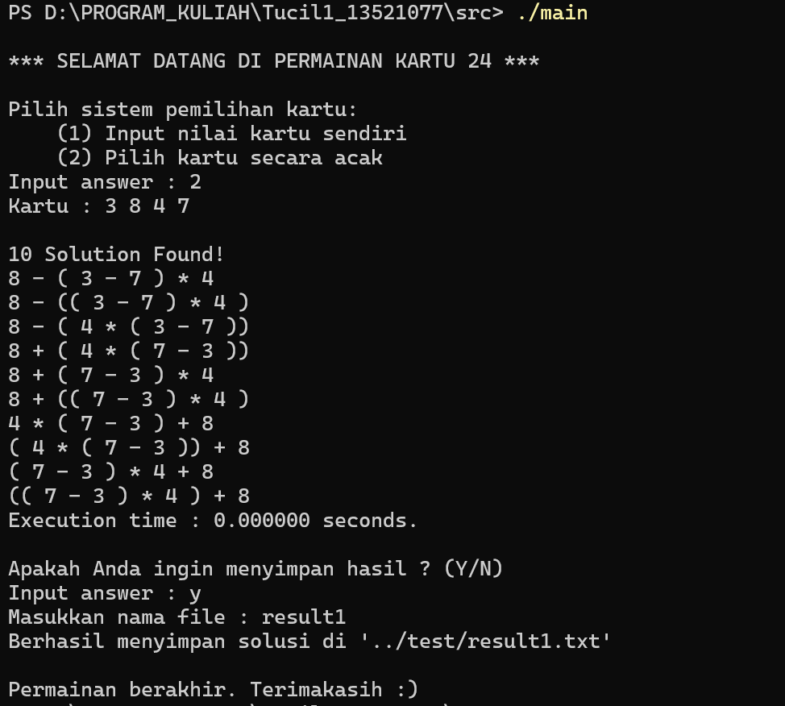

# Penerapan Algoritma Brute Force Pada Permainan Kartu 24
TUGAS KECIL 1 IF2211 STRATEGI ALGORITMA

## Daftar Isi
* [Penjelasan Ringkas Program](#penjelasan-ringkas-program)
* [Setup Program](#setup-program)
* [Cara Menjalankan Program](#cara-menjalankan-program)
* [Daftar Fitur](#daftar-fitur)
* [Status Pengerjaan](#status-pengerjaan)
* [Screenshot program](#screenshot-program)
* [Struktur Program](#struktur-program)
* [Kontributor](#kontributor)

## Penjelasan Ringkas Program
Permainan kartu 24 adalah permainan kartu aritmatika dengan tujuan mencari operasi aritmatika yang terdiri dari 4 buah angka random sehingga mendapatkan hasil akhir sejumlah 24. Permainan Kartu 24 biasa dimainkan dengan menggunakan kartu remi yang terdiri dari 52 kartu dalam empat suit (sekop, hati, keriting, dan wajik) yang masing-masing terdiri dari 13 kartu (As, 2, 3, 4, 5, 6, 7, 8, 9, 10, Jack, Queen, dan King) dengan As bernilai 1, Jack bernilai 11, Queen bernilai 12, King bernilai 13, sedangkan kartu bilangan memiliki nilai dari bilangan itu sendiri. Operasi dasar matematika yang dapat digunakan antara lain penjumlahan (+), pengurangan (-), perkalian (×), pembagian (/) dan tanda kurung ( () ). Pemecahan persoalan permainan kartu 24 ini dikembangkan dalam Bahasa Pemrograman C++. Program berbasis CLI (Command Line Interface).

## Setup Program
- Pastikan komputer telah terinstall compiler C++ contohnya GCC (Gnu Compiler Collection)
- Cloning Repositori dengan mengetikkan perintah berikut pada terminal <br>
   ```git clone https://github.com/munzayanahusn/Tucil1_13521077.git```

## Cara Menjalankan Program
### Menjalankan Program Melalui Visual Studio Code
1. Buka Program di Visual Studio Code <br>
2. Jalankan program dengan klik simbol Run Code

### Menjalankan Program Melalui Command Prompt/Terminal
1. Buka Command Prompt/Terminal <br>
2. Arahkan direktori sesuai tempat penyimpanan file Anda <br>
    ```cd <sesuaikan dengan path penyimpanan Anda>\Tucil1_13521077\src\``` <br>
3. Compile program dengan mengetikkan <br>
    ```g++ main.cpp -o main ``` <br>
4. Jalankan program dengan mengetikkan <br>
    ```./main```<br>
5. Tunggu hingga muncul splash screen yang menandakan program berhasil dijalankan

## Daftar Fitur
1. Generate 4 random number sebagai input
2. Memasukkan 4 random number secara manual oleh user
3. Menampilkan jumlah total solusi permainan kartu 24
4. Menampilkan setiap solusi permainan kartu 24
5. Menampilkan waktu eksekusi program
6. Menyimpan solusi dalam file .txt

## Status Pengerjaan
- [x] Generate 4 random number sebagai input
- [x] Memasukkan 4 random number secara manual oleh user
- [x] Menampilkan jumlah total solusi permainan kartu 24
- [x] Menampilkan setiap solusi permainan kartu 24
- [x] Menampilkan waktu eksekusi program
- [x] Menyimpan solusi dalam file .txt

| No | Poin                                        | Ya    | Tidak |
|:--:|:-------------------------------------------:|:-----:|:-----:|
| 1  |	Program berhasil dikompilasi tanpa kesalahan	| :heavy_check_mark:  |       |	
| 2  |	Program berhasil running                     | :heavy_check_mark: |       |	
| 3  |	Program dapat membaca input / generate sendiri dan memberikan luaran	| :heavy_check_mark: |  |	
| 4  |	Solusi yang diberikan program memenuhi (berhasil mencapai 24)        | :heavy_check_mark: |  |
| 5  |	Program dapat menyimpan solusi dalam file teks                       | :heavy_check_mark: |  |

## Screenshot Program
[](program.png)

## Struktur Program
```bash
└───TugasBesarIF2124_050
    ├───bin
    │   └───main.exe
    ├───doc
    │   └───Tucil1_K01_13521077_Husnia Munzayana.pdf
    ├───src
    │   ├───calculation.cpp
    │   └───main.cpp
    ├───test
    │   ├───result1.txt
    │   ├───result2.txt
    │   ├───result3.txt
    │   ├───result4.txt
    │   ├───result5.txt
    │   ├───result6.txt
    │   ├───result7.txt
    │   └───result8.txt
    ├───program.png
    └───README.md
```
## Kontributor
Husnia Munzayana <br>
13521077
